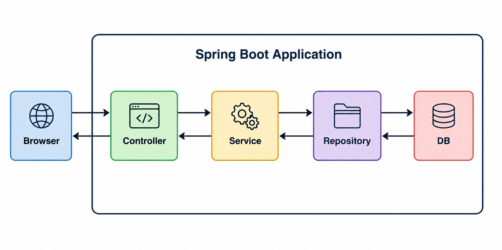
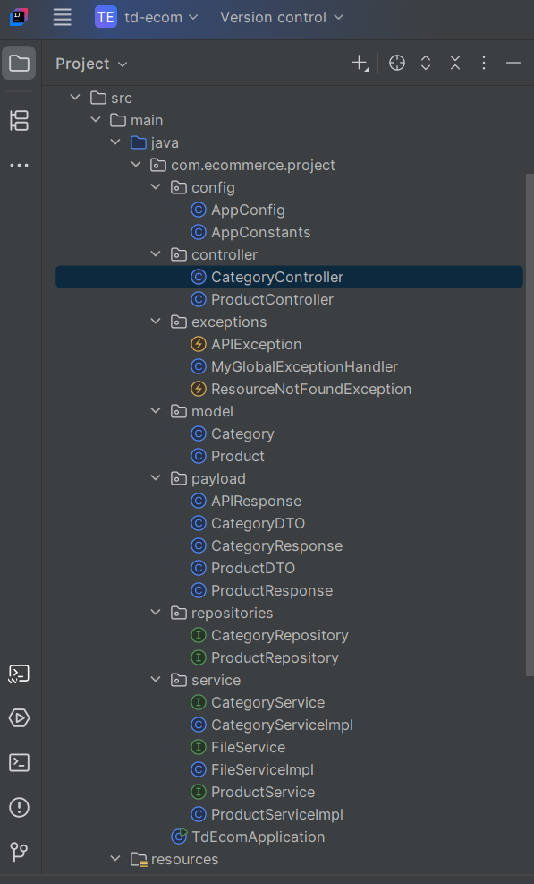
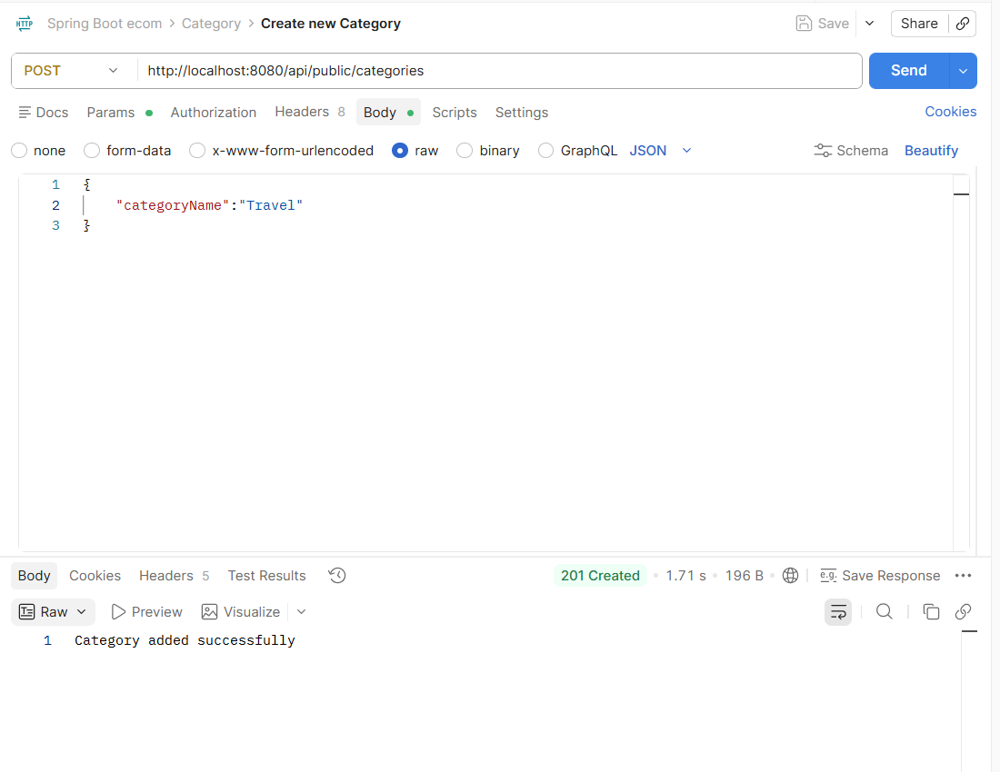
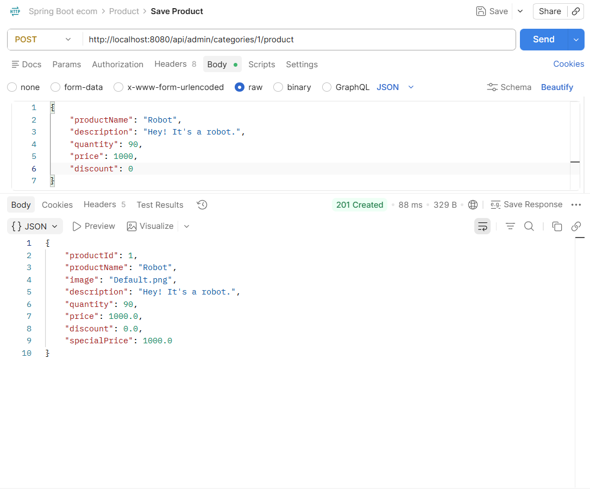
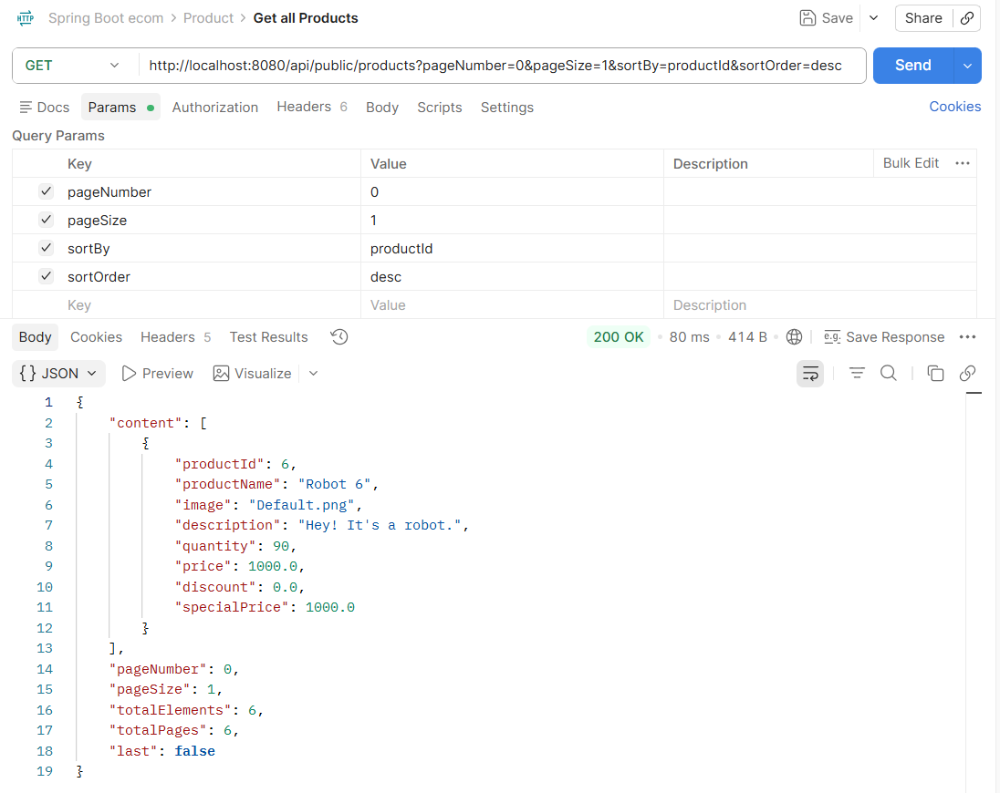
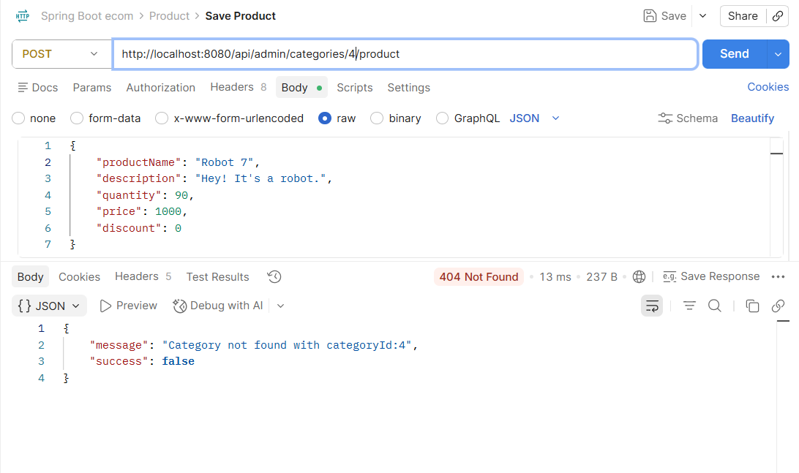
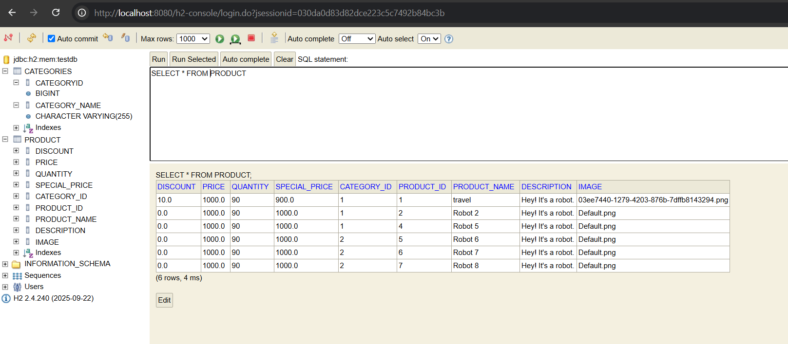

# Spring Boot Ecommerce Backend Application

## Overview

This project is a backend Ecommerce application built using Java, Spring Boot, Spring Data JPA, Hibernate, and MySQL.

The application exposes RESTful APIs for managing product categories and products while implementing key backend development concepts such as layered architecture, entity relationships, validation, pagination, sorting, and exception handling.

This project was built as part of my journey to strengthen my backend engineering skills and gain hands-on experience with enterprise Java development.

---

## Features Implemented

### Category Management

* Create Category
* Update Category
* Delete Category
* Get All Categories

### Product Management

* Create Product
* Update Product
* Delete Product
* Get Product By ID
* Get All Products
* Get Products By Keyword

### Backend Functionality

* REST API Development
* Spring Boot Application Architecture
* Spring Data JPA
* Hibernate ORM
* Request Validation
* Global Exception Handling
* Pagination
* Sorting
* Entity Relationships
* DTO Usage
* MySQL Database Integration

---

## Tech Stack

### Backend

* Java
* Spring Boot
* Spring Data JPA
* Hibernate
* MySQL
* Lombok
* Maven

### Tools

* IntelliJ IDEA
* Postman
* Git
* GitHub

---

## Project Architecture

The application follows a layered architecture:

Postman

↓

Controller Layer

↓

Service Layer

↓

Repository Layer

↓

Hibernate / JPA

↓

MySQL Database

---

## Project Structure

src/main/java

├── controller

├── service

├── repository

├── entity

├── dto

├── exception

└── config

---

## Screenshots

### Architecture Diagram

### Project Structure

### Categories API

### Products API

### Pagination and Sorting

### Validation Handling

### Database Schema

---

## Learning Outcomes

Through this project, I gained practical experience in:

* Designing RESTful APIs using Spring Boot
* Building layered backend applications
* Working with Hibernate and JPA
* Managing entity relationships
* Implementing validation and exception handling
* Performing pagination and sorting
* Integrating MySQL with Spring Boot
* Using Git and GitHub for version control

---

## Upcoming Features

The following features will be added as I continue developing the application:

* Spring Security
* Authentication & Authorization
* JWT Based Security
* Shopping Cart Module
* Order Management
* Payment Integration
* Cloud Deployment

---

## Author

Tina Dey

GitHub: https://github.com/TinaDey
